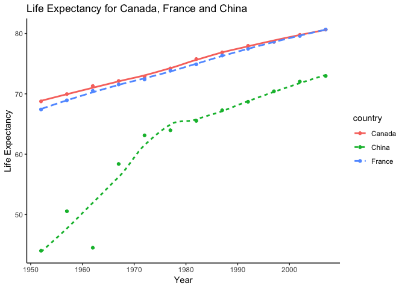

Hw04-zhamadeh
================

Data Reshaping Prompts (and relationship to aggregation)
--------------------------------------------------------

**Problem**: You have data in one “shape” but you wish it were in another. Usually this is because the alternative shape is superior for presenting a table, making a figure, or doing aggregation and statistical analysis.

**Solution**: Reshape your data. For simple reshaping, gather() and spread() from tidyr will suffice. Do the thing that is possible / easier now that your data has a new shape.

### Activity \#2

-   Make a tibble with one row per year and columns for life expectancy for two or more countries.
    -   Use knitr::kable() to make this table look pretty in your rendered homework.
    -   Take advantage of this new data shape to scatterplot life expectancy for one country against that of another.

For this activity, we're going to bring in our rectangular dataset, gapminder, and use `filter()` and `select()` to look at life expectancy for 3 different countries. First lets begin by loading our packages.

``` r
suppressPackageStartupMessages(library(tidyverse))
suppressPackageStartupMessages(library(gapminder))
```

Now we're going to filter our dataset for the life expectancy data on Canada, China and France.

``` r
filt_gap <- gapminder %>%
  filter(country %in% c("Canada","France","China")) %>% #filter for countries of interest
  select(country, year, lifeExp) # select only country, year and life expectancy

knitr::kable(filt_gap) #print out in table
```

| country |  year|   lifeExp|
|:--------|-----:|---------:|
| Canada  |  1952|  68.75000|
| Canada  |  1957|  69.96000|
| Canada  |  1962|  71.30000|
| Canada  |  1967|  72.13000|
| Canada  |  1972|  72.88000|
| Canada  |  1977|  74.21000|
| Canada  |  1982|  75.76000|
| Canada  |  1987|  76.86000|
| Canada  |  1992|  77.95000|
| Canada  |  1997|  78.61000|
| Canada  |  2002|  79.77000|
| Canada  |  2007|  80.65300|
| China   |  1952|  44.00000|
| China   |  1957|  50.54896|
| China   |  1962|  44.50136|
| China   |  1967|  58.38112|
| China   |  1972|  63.11888|
| China   |  1977|  63.96736|
| China   |  1982|  65.52500|
| China   |  1987|  67.27400|
| China   |  1992|  68.69000|
| China   |  1997|  70.42600|
| China   |  2002|  72.02800|
| China   |  2007|  72.96100|
| France  |  1952|  67.41000|
| France  |  1957|  68.93000|
| France  |  1962|  70.51000|
| France  |  1967|  71.55000|
| France  |  1972|  72.38000|
| France  |  1977|  73.83000|
| France  |  1982|  74.89000|
| France  |  1987|  76.34000|
| France  |  1992|  77.46000|
| France  |  1997|  78.64000|
| France  |  2002|  79.59000|
| France  |  2007|  80.65700|

Now that we have our filtered dataset, we can reshape things. We will use the `spread()` function to split up country and use our variable life expectancy to create columns of life expectancy specific to each country.

``` r
reshape_gap <- filt_gap %>%
  spread(country, lifeExp) #spread country across columns and fill in lifeExp data

knitr::kable(reshape_gap) #present in table
```

|  year|  Canada|     China|  France|
|-----:|-------:|---------:|-------:|
|  1952|  68.750|  44.00000|  67.410|
|  1957|  69.960|  50.54896|  68.930|
|  1962|  71.300|  44.50136|  70.510|
|  1967|  72.130|  58.38112|  71.550|
|  1972|  72.880|  63.11888|  72.380|
|  1977|  74.210|  63.96736|  73.830|
|  1982|  75.760|  65.52500|  74.890|
|  1987|  76.860|  67.27400|  76.340|
|  1992|  77.950|  68.69000|  77.460|
|  1997|  78.610|  70.42600|  78.640|
|  2002|  79.770|  72.02800|  79.590|
|  2007|  80.653|  72.96100|  80.657|

Now that we've successfully reshaped our filtered data lets plot life expectancy over time using ggplot2. It would be easier to use our filtered data before reshaping, however to demonstrate the use of the `gather()` function, we will revert our reshaped data back to its un-reshaped form using this method.

``` r
unreshap_gap <- reshape_gap %>%
  gather(country, lifeExp, Canada, China, France) #gather columns of country and make one lifeExp column
knitr::kable(unreshap_gap) #print out table
```

|  year| country |   lifeExp|
|-----:|:--------|---------:|
|  1952| Canada  |  68.75000|
|  1957| Canada  |  69.96000|
|  1962| Canada  |  71.30000|
|  1967| Canada  |  72.13000|
|  1972| Canada  |  72.88000|
|  1977| Canada  |  74.21000|
|  1982| Canada  |  75.76000|
|  1987| Canada  |  76.86000|
|  1992| Canada  |  77.95000|
|  1997| Canada  |  78.61000|
|  2002| Canada  |  79.77000|
|  2007| Canada  |  80.65300|
|  1952| China   |  44.00000|
|  1957| China   |  50.54896|
|  1962| China   |  44.50136|
|  1967| China   |  58.38112|
|  1972| China   |  63.11888|
|  1977| China   |  63.96736|
|  1982| China   |  65.52500|
|  1987| China   |  67.27400|
|  1992| China   |  68.69000|
|  1997| China   |  70.42600|
|  2002| China   |  72.02800|
|  2007| China   |  72.96100|
|  1952| France  |  67.41000|
|  1957| France  |  68.93000|
|  1962| France  |  70.51000|
|  1967| France  |  71.55000|
|  1972| France  |  72.38000|
|  1977| France  |  73.83000|
|  1982| France  |  74.89000|
|  1987| France  |  76.34000|
|  1992| France  |  77.46000|
|  1997| France  |  78.64000|
|  2002| France  |  79.59000|
|  2007| France  |  80.65700|

``` r
unreshap_gap %>% # take our filtered data  before reshaping
  ggplot(aes(year,lifeExp)) + #plot lifeExp vs year
  geom_point(aes(colour=country)) +  #scatterplot for each country
  geom_smooth(aes(linetype=country, colour=country),se=FALSE) + #add line connecting each countries points
  labs(x="Year", y="Life Expectancy", title="Life Expectancy for Canada, France and China") + #add labels
  theme_classic() #change theme
```

    ## `geom_smooth()` using method = 'loess' and formula 'y ~ x'



Success! We can see from the plot that Canada and France have had similar trajectories for life expectancy over time with Canada being only a year or two higher in the mid-90's, a difference that becomes negligible by 2000. China has a significantly lower life expectancy by over 25 years in the mid-90's only to minimize that gap to about 10 years.

Join Prompts (join, merge, look up)
-----------------------------------

**Problem**: You have two data sources and you need info from both in one new data object.

**Solution**: Perform a join, which borrows terminology from the database world, specifically SQL.

### Activity \#1

Create a second data frame, complementary to Gapminder. Join this with (part of) Gapminder using a dplyr join function and make some observations about the process and result. Explore the different types of joins. Examples of a second data frame you could build: \* One row per country, a country variable and one or more variables with extra info, such as language spoken, NATO membership, national animal, or capitol city. \* One row per continent, a continent variable and one or more variables with extra info, such as northern versus southern hemisphere.

Here, lets make a complementary dataframe to gapminder that describes the national animal of several countries.

``` r
nat_animal <- c("Bald eagle", "Tiger","Beaver", "Swan", "Rooster", "Lion") #country animal
country <- c("United States","Bangladesh","Canada","Denmark","France", "Libya") #country

count_animal <- data.frame(country, nat_animal) #make data frame of two vectors

knitr::kable(count_animal, col.names=c("Country","National Animal")) #print out table with labels
```

| Country       | National Animal |
|:--------------|:----------------|
| United States | Bald eagle      |
| Bangladesh    | Tiger           |
| Canada        | Beaver          |
| Denmark       | Swan            |
| France        | Rooster         |
| Libya         | Lion            |

Now lets join this new dataframe with gapminder using the `inner_join(x,y)` method which returns all rows from x, where there are a matching value of y, and all columns from x and y. Note, because list of national animals is missing some countries, the observations for these countries were excluded.

``` r
inner_join <- inner_join(gapminder, count_animal) #join datasets
```

    ## Joining, by = "country"

    ## Warning: Column `country` joining factors with different levels, coercing
    ## to character vector

``` r
knitr::kable(inner_join) # print table
```

| country       | continent |  year|  lifeExp|        pop|   gdpPercap| nat\_animal |
|:--------------|:----------|-----:|--------:|----------:|-----------:|:------------|
| Bangladesh    | Asia      |  1952|   37.484|   46886859|    684.2442| Tiger       |
| Bangladesh    | Asia      |  1957|   39.348|   51365468|    661.6375| Tiger       |
| Bangladesh    | Asia      |  1962|   41.216|   56839289|    686.3416| Tiger       |
| Bangladesh    | Asia      |  1967|   43.453|   62821884|    721.1861| Tiger       |
| Bangladesh    | Asia      |  1972|   45.252|   70759295|    630.2336| Tiger       |
| Bangladesh    | Asia      |  1977|   46.923|   80428306|    659.8772| Tiger       |
| Bangladesh    | Asia      |  1982|   50.009|   93074406|    676.9819| Tiger       |
| Bangladesh    | Asia      |  1987|   52.819|  103764241|    751.9794| Tiger       |
| Bangladesh    | Asia      |  1992|   56.018|  113704579|    837.8102| Tiger       |
| Bangladesh    | Asia      |  1997|   59.412|  123315288|    972.7700| Tiger       |
| Bangladesh    | Asia      |  2002|   62.013|  135656790|   1136.3904| Tiger       |
| Bangladesh    | Asia      |  2007|   64.062|  150448339|   1391.2538| Tiger       |
| Canada        | Americas  |  1952|   68.750|   14785584|  11367.1611| Beaver      |
| Canada        | Americas  |  1957|   69.960|   17010154|  12489.9501| Beaver      |
| Canada        | Americas  |  1962|   71.300|   18985849|  13462.4855| Beaver      |
| Canada        | Americas  |  1967|   72.130|   20819767|  16076.5880| Beaver      |
| Canada        | Americas  |  1972|   72.880|   22284500|  18970.5709| Beaver      |
| Canada        | Americas  |  1977|   74.210|   23796400|  22090.8831| Beaver      |
| Canada        | Americas  |  1982|   75.760|   25201900|  22898.7921| Beaver      |
| Canada        | Americas  |  1987|   76.860|   26549700|  26626.5150| Beaver      |
| Canada        | Americas  |  1992|   77.950|   28523502|  26342.8843| Beaver      |
| Canada        | Americas  |  1997|   78.610|   30305843|  28954.9259| Beaver      |
| Canada        | Americas  |  2002|   79.770|   31902268|  33328.9651| Beaver      |
| Canada        | Americas  |  2007|   80.653|   33390141|  36319.2350| Beaver      |
| Denmark       | Europe    |  1952|   70.780|    4334000|   9692.3852| Swan        |
| Denmark       | Europe    |  1957|   71.810|    4487831|  11099.6593| Swan        |
| Denmark       | Europe    |  1962|   72.350|    4646899|  13583.3135| Swan        |
| Denmark       | Europe    |  1967|   72.960|    4838800|  15937.2112| Swan        |
| Denmark       | Europe    |  1972|   73.470|    4991596|  18866.2072| Swan        |
| Denmark       | Europe    |  1977|   74.690|    5088419|  20422.9015| Swan        |
| Denmark       | Europe    |  1982|   74.630|    5117810|  21688.0405| Swan        |
| Denmark       | Europe    |  1987|   74.800|    5127024|  25116.1758| Swan        |
| Denmark       | Europe    |  1992|   75.330|    5171393|  26406.7399| Swan        |
| Denmark       | Europe    |  1997|   76.110|    5283663|  29804.3457| Swan        |
| Denmark       | Europe    |  2002|   77.180|    5374693|  32166.5001| Swan        |
| Denmark       | Europe    |  2007|   78.332|    5468120|  35278.4187| Swan        |
| France        | Europe    |  1952|   67.410|   42459667|   7029.8093| Rooster     |
| France        | Europe    |  1957|   68.930|   44310863|   8662.8349| Rooster     |
| France        | Europe    |  1962|   70.510|   47124000|  10560.4855| Rooster     |
| France        | Europe    |  1967|   71.550|   49569000|  12999.9177| Rooster     |
| France        | Europe    |  1972|   72.380|   51732000|  16107.1917| Rooster     |
| France        | Europe    |  1977|   73.830|   53165019|  18292.6351| Rooster     |
| France        | Europe    |  1982|   74.890|   54433565|  20293.8975| Rooster     |
| France        | Europe    |  1987|   76.340|   55630100|  22066.4421| Rooster     |
| France        | Europe    |  1992|   77.460|   57374179|  24703.7961| Rooster     |
| France        | Europe    |  1997|   78.640|   58623428|  25889.7849| Rooster     |
| France        | Europe    |  2002|   79.590|   59925035|  28926.0323| Rooster     |
| France        | Europe    |  2007|   80.657|   61083916|  30470.0167| Rooster     |
| Libya         | Africa    |  1952|   42.723|    1019729|   2387.5481| Lion        |
| Libya         | Africa    |  1957|   45.289|    1201578|   3448.2844| Lion        |
| Libya         | Africa    |  1962|   47.808|    1441863|   6757.0308| Lion        |
| Libya         | Africa    |  1967|   50.227|    1759224|  18772.7517| Lion        |
| Libya         | Africa    |  1972|   52.773|    2183877|  21011.4972| Lion        |
| Libya         | Africa    |  1977|   57.442|    2721783|  21951.2118| Lion        |
| Libya         | Africa    |  1982|   62.155|    3344074|  17364.2754| Lion        |
| Libya         | Africa    |  1987|   66.234|    3799845|  11770.5898| Lion        |
| Libya         | Africa    |  1992|   68.755|    4364501|   9640.1385| Lion        |
| Libya         | Africa    |  1997|   71.555|    4759670|   9467.4461| Lion        |
| Libya         | Africa    |  2002|   72.737|    5368585|   9534.6775| Lion        |
| Libya         | Africa    |  2007|   73.952|    6036914|  12057.4993| Lion        |
| United States | Americas  |  1952|   68.440|  157553000|  13990.4821| Bald eagle  |
| United States | Americas  |  1957|   69.490|  171984000|  14847.1271| Bald eagle  |
| United States | Americas  |  1962|   70.210|  186538000|  16173.1459| Bald eagle  |
| United States | Americas  |  1967|   70.760|  198712000|  19530.3656| Bald eagle  |
| United States | Americas  |  1972|   71.340|  209896000|  21806.0359| Bald eagle  |
| United States | Americas  |  1977|   73.380|  220239000|  24072.6321| Bald eagle  |
| United States | Americas  |  1982|   74.650|  232187835|  25009.5591| Bald eagle  |
| United States | Americas  |  1987|   75.020|  242803533|  29884.3504| Bald eagle  |
| United States | Americas  |  1992|   76.090|  256894189|  32003.9322| Bald eagle  |
| United States | Americas  |  1997|   76.810|  272911760|  35767.4330| Bald eagle  |
| United States | Americas  |  2002|   77.310|  287675526|  39097.0995| Bald eagle  |
| United States | Americas  |  2007|   78.242|  301139947|  42951.6531| Bald eagle  |

Now lets use `semi_join(x,y)` to join these two data frames. This function returns all rows from x where there are a matching value of y, keeping just columns from x. Note here we don't add the column for country aninmal, we only keep the observations of gapminder that have a corresponding national animal from our data set.

``` r
semi_join <- semi_join(gapminder, count_animal) # join datasets
```

    ## Joining, by = "country"

    ## Warning: Column `country` joining factors with different levels, coercing
    ## to character vector

``` r
knitr::kable(semi_join) # print table
```

| country       | continent |  year|  lifeExp|        pop|   gdpPercap|
|:--------------|:----------|-----:|--------:|----------:|-----------:|
| Bangladesh    | Asia      |  1952|   37.484|   46886859|    684.2442|
| Bangladesh    | Asia      |  1957|   39.348|   51365468|    661.6375|
| Bangladesh    | Asia      |  1962|   41.216|   56839289|    686.3416|
| Bangladesh    | Asia      |  1967|   43.453|   62821884|    721.1861|
| Bangladesh    | Asia      |  1972|   45.252|   70759295|    630.2336|
| Bangladesh    | Asia      |  1977|   46.923|   80428306|    659.8772|
| Bangladesh    | Asia      |  1982|   50.009|   93074406|    676.9819|
| Bangladesh    | Asia      |  1987|   52.819|  103764241|    751.9794|
| Bangladesh    | Asia      |  1992|   56.018|  113704579|    837.8102|
| Bangladesh    | Asia      |  1997|   59.412|  123315288|    972.7700|
| Bangladesh    | Asia      |  2002|   62.013|  135656790|   1136.3904|
| Bangladesh    | Asia      |  2007|   64.062|  150448339|   1391.2538|
| Canada        | Americas  |  1952|   68.750|   14785584|  11367.1611|
| Canada        | Americas  |  1957|   69.960|   17010154|  12489.9501|
| Canada        | Americas  |  1962|   71.300|   18985849|  13462.4855|
| Canada        | Americas  |  1967|   72.130|   20819767|  16076.5880|
| Canada        | Americas  |  1972|   72.880|   22284500|  18970.5709|
| Canada        | Americas  |  1977|   74.210|   23796400|  22090.8831|
| Canada        | Americas  |  1982|   75.760|   25201900|  22898.7921|
| Canada        | Americas  |  1987|   76.860|   26549700|  26626.5150|
| Canada        | Americas  |  1992|   77.950|   28523502|  26342.8843|
| Canada        | Americas  |  1997|   78.610|   30305843|  28954.9259|
| Canada        | Americas  |  2002|   79.770|   31902268|  33328.9651|
| Canada        | Americas  |  2007|   80.653|   33390141|  36319.2350|
| Denmark       | Europe    |  1952|   70.780|    4334000|   9692.3852|
| Denmark       | Europe    |  1957|   71.810|    4487831|  11099.6593|
| Denmark       | Europe    |  1962|   72.350|    4646899|  13583.3135|
| Denmark       | Europe    |  1967|   72.960|    4838800|  15937.2112|
| Denmark       | Europe    |  1972|   73.470|    4991596|  18866.2072|
| Denmark       | Europe    |  1977|   74.690|    5088419|  20422.9015|
| Denmark       | Europe    |  1982|   74.630|    5117810|  21688.0405|
| Denmark       | Europe    |  1987|   74.800|    5127024|  25116.1758|
| Denmark       | Europe    |  1992|   75.330|    5171393|  26406.7399|
| Denmark       | Europe    |  1997|   76.110|    5283663|  29804.3457|
| Denmark       | Europe    |  2002|   77.180|    5374693|  32166.5001|
| Denmark       | Europe    |  2007|   78.332|    5468120|  35278.4187|
| France        | Europe    |  1952|   67.410|   42459667|   7029.8093|
| France        | Europe    |  1957|   68.930|   44310863|   8662.8349|
| France        | Europe    |  1962|   70.510|   47124000|  10560.4855|
| France        | Europe    |  1967|   71.550|   49569000|  12999.9177|
| France        | Europe    |  1972|   72.380|   51732000|  16107.1917|
| France        | Europe    |  1977|   73.830|   53165019|  18292.6351|
| France        | Europe    |  1982|   74.890|   54433565|  20293.8975|
| France        | Europe    |  1987|   76.340|   55630100|  22066.4421|
| France        | Europe    |  1992|   77.460|   57374179|  24703.7961|
| France        | Europe    |  1997|   78.640|   58623428|  25889.7849|
| France        | Europe    |  2002|   79.590|   59925035|  28926.0323|
| France        | Europe    |  2007|   80.657|   61083916|  30470.0167|
| Libya         | Africa    |  1952|   42.723|    1019729|   2387.5481|
| Libya         | Africa    |  1957|   45.289|    1201578|   3448.2844|
| Libya         | Africa    |  1962|   47.808|    1441863|   6757.0308|
| Libya         | Africa    |  1967|   50.227|    1759224|  18772.7517|
| Libya         | Africa    |  1972|   52.773|    2183877|  21011.4972|
| Libya         | Africa    |  1977|   57.442|    2721783|  21951.2118|
| Libya         | Africa    |  1982|   62.155|    3344074|  17364.2754|
| Libya         | Africa    |  1987|   66.234|    3799845|  11770.5898|
| Libya         | Africa    |  1992|   68.755|    4364501|   9640.1385|
| Libya         | Africa    |  1997|   71.555|    4759670|   9467.4461|
| Libya         | Africa    |  2002|   72.737|    5368585|   9534.6775|
| Libya         | Africa    |  2007|   73.952|    6036914|  12057.4993|
| United States | Americas  |  1952|   68.440|  157553000|  13990.4821|
| United States | Americas  |  1957|   69.490|  171984000|  14847.1271|
| United States | Americas  |  1962|   70.210|  186538000|  16173.1459|
| United States | Americas  |  1967|   70.760|  198712000|  19530.3656|
| United States | Americas  |  1972|   71.340|  209896000|  21806.0359|
| United States | Americas  |  1977|   73.380|  220239000|  24072.6321|
| United States | Americas  |  1982|   74.650|  232187835|  25009.5591|
| United States | Americas  |  1987|   75.020|  242803533|  29884.3504|
| United States | Americas  |  1992|   76.090|  256894189|  32003.9322|
| United States | Americas  |  1997|   76.810|  272911760|  35767.4330|
| United States | Americas  |  2002|   77.310|  287675526|  39097.0995|
| United States | Americas  |  2007|   78.242|  301139947|  42951.6531|

Alternatively, we can use the `anti_join(x,y)` function to retrieve the opposite results, observations from x (gapminder) that did not have a coressponding value in y (count\_animal). This includes only countries which did not have a national animal mentioned in our dataset.

``` r
anti_join <- anti_join(gapminder,count_animal) # join datasets
```

    ## Joining, by = "country"

    ## Warning: Column `country` joining factors with different levels, coercing
    ## to character vector

``` r
knitr::kable(head(anti_join)) #print only the head of the table because its too long
```

| country     | continent |  year|  lifeExp|       pop|  gdpPercap|
|:------------|:----------|-----:|--------:|---------:|----------:|
| Afghanistan | Asia      |  1952|   28.801|   8425333|   779.4453|
| Afghanistan | Asia      |  1957|   30.332|   9240934|   820.8530|
| Afghanistan | Asia      |  1962|   31.997|  10267083|   853.1007|
| Afghanistan | Asia      |  1967|   34.020|  11537966|   836.1971|
| Afghanistan | Asia      |  1972|   36.088|  13079460|   739.9811|
| Afghanistan | Asia      |  1977|   38.438|  14880372|   786.1134|

Lastly, we can use the `full_join(x,y)` function to return all rows and columns from both x and y. This means our country animal column is added to gapminder but where there are missing values, NA is used.

``` r
full_join <- full_join(gapminder,count_animal)
```

    ## Joining, by = "country"

    ## Warning: Column `country` joining factors with different levels, coercing
    ## to character vector

``` r
knitr::kable(head(full_join)) # only first few because its so long
```

| country     | continent |  year|  lifeExp|       pop|  gdpPercap| nat\_animal |
|:------------|:----------|-----:|--------:|---------:|----------:|:------------|
| Afghanistan | Asia      |  1952|   28.801|   8425333|   779.4453| NA          |
| Afghanistan | Asia      |  1957|   30.332|   9240934|   820.8530| NA          |
| Afghanistan | Asia      |  1962|   31.997|  10267083|   853.1007| NA          |
| Afghanistan | Asia      |  1967|   34.020|  11537966|   836.1971| NA          |
| Afghanistan | Asia      |  1972|   36.088|  13079460|   739.9811| NA          |
| Afghanistan | Asia      |  1977|   38.438|  14880372|   786.1134| NA          |
